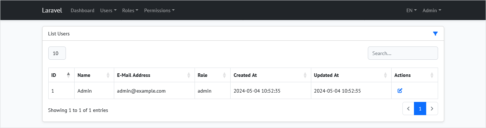
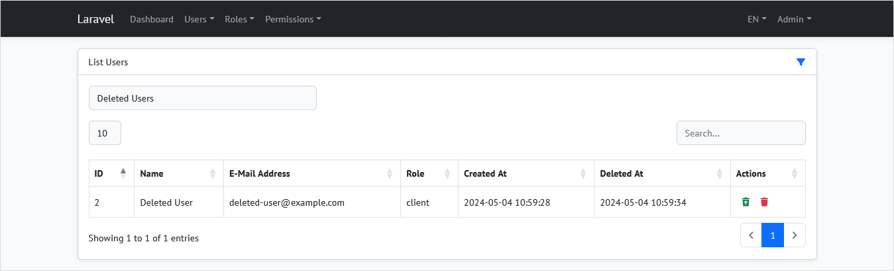
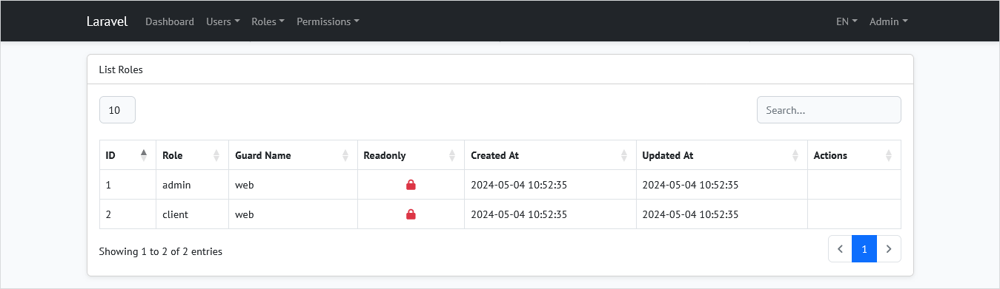
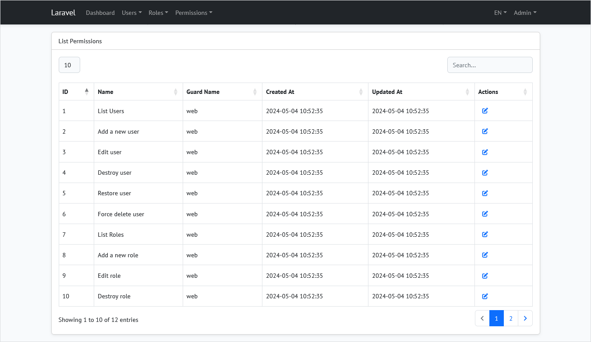
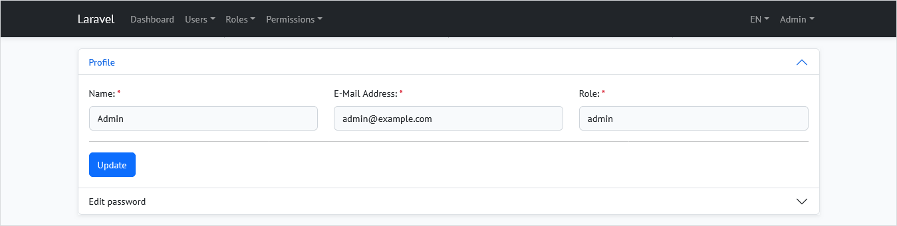
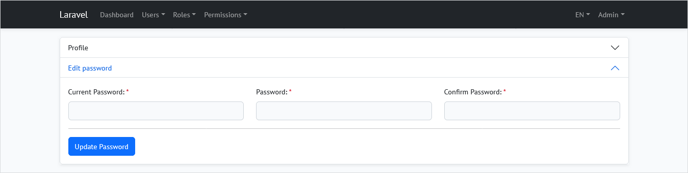

# Laravel SPA Inertia Vue3

The project is a SPA multilingual admin panel basically based on the [Laravel 8](https://laravel.com/docs/8.x/installation), [Inertia](https://inertiajs.com/) and [Bootstrap 5](https://getbootstrap.com/docs/5.2/getting-started/introduction/).

## Setup

Clone the repo and follow below steps.

1. Run `composer install`
2. Copy `.env.example` to `.env`
3. Run `php artisan key:generate` to generate application key
4. Set valid database credentials of env variables `DB_DATABASE`, `DB_USERNAME`, and `DB_PASSWORD`
5. Run `php artisan migrate --seed` to start all migrations and seed your database
6. Run `npm i` (Recommended node version `>= V13.14.0`)
7. Run `npm run dev` or `npm run prod` as per your environment

## Demo Credentials

### Admin Login

- **Email:** admin@example.com
- **Password:** qwerty

## Credits & References

The following software libraries and other references are utilized in the creation this project.

- [Laravel](https://github.com/laravel/laravel)
- [Laravel UI](https://github.com/laravel/ui)
- [Inertia Laravel](https://github.com/inertiajs/inertia-laravel)
- [Tighten Ziggy](https://github.com/tighten/ziggy)
- [Marc Cámara Laravel Localization](https://github.com/mcamara/laravel-localization)
- [Spatie Laravel Roles & Permissions](https://github.com/spatie/laravel-permission)
- [Yajra Laravel Datatables](https://github.com/yajra/laravel-datatables)
- [Soft Delete & Restore](https://codeanddeploy.com/blog/laravel/complete-laravel-8-soft-delete-restore-deleted-records-tutorial)
- [Bootstrap](https://getbootstrap.com/)
- [DataTables](https://github.com/DataTables/Dist-DataTables-Bootstrap4)
- [SweetAlert2](https://github.com/sweetalert2/sweetalert2)

## License

The project is open-sourced software licensed under the [MIT license](https://opensource.org/licenses/MIT).

## ScreenShots

### List Users

### List Deleted Users

### List Roles

### List Permissions

### Profile

### Profile Edit Password

